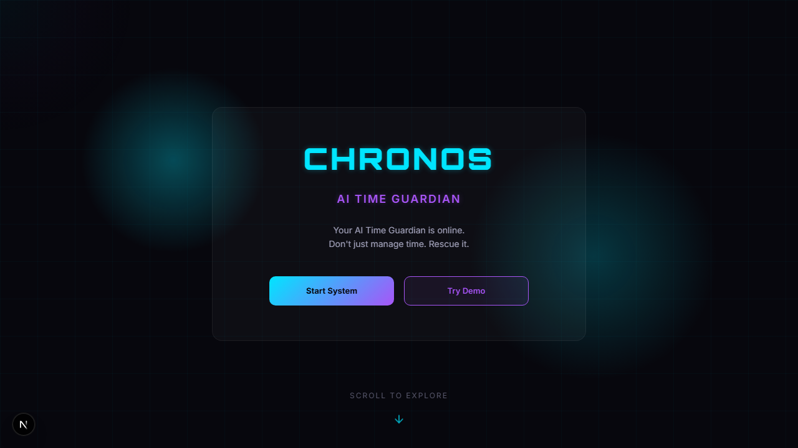
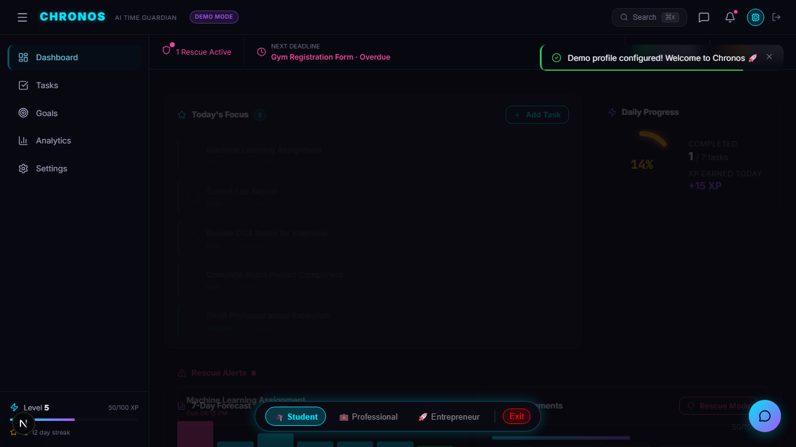
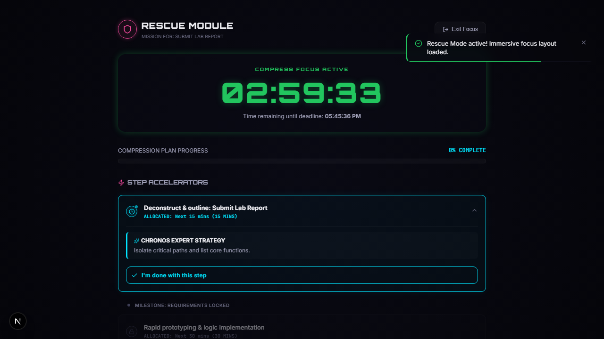
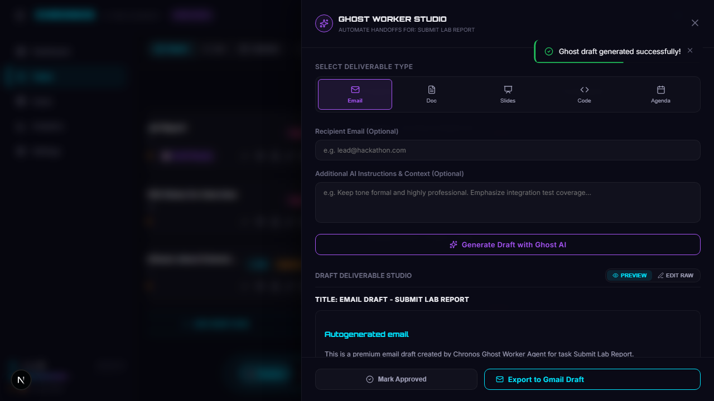
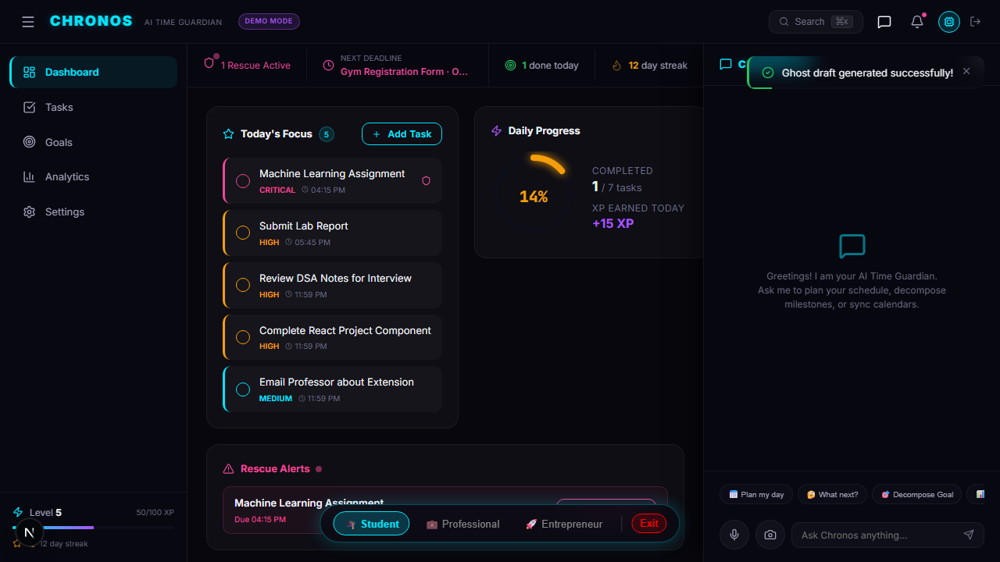
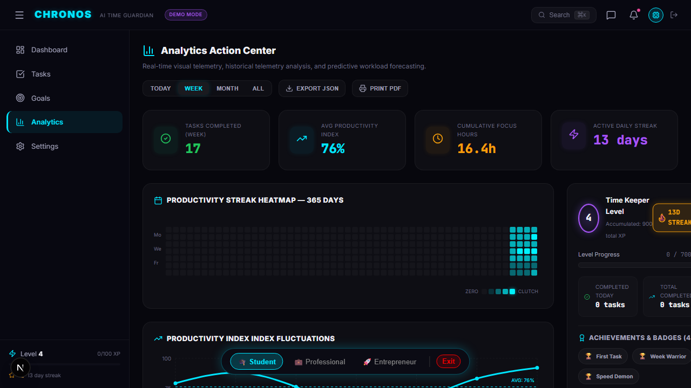

# ⏳ Chronos — Your AI Time Guardian

> **Winner-Ready Submission for Problem Statement 1: The Last-Minute Life Saver**  
> *An autonomous, proactive AI-powered productivity companion that moves beyond passive notification fatigue to actively rescue deadlines, draft deliverables, predict bottlenecks, and guide users step-by-step through high-pressure time blocks.*

---

## 🔗 Live Submission Links

| Deliverable | URL / Resource |
|-------------|----------------|
| **Deployed Application** | [🚀 Click Here to Open Chronos (Live on Google Cloud Run)](https://chronos-435347523554.asia-south1.run.app/) |
| **GitHub Repository** | [📂 Source Code Repository](https://github.com/RsbhThakur/chronos) |
| **Project Description (Google Doc)** | [📄 Complete Project Document](https://docs.google.com/document/d/1TMrB_fpBILqKIFLBay5Xrk2egZlI1uUx8cnrGPKSnqo/edit) |

---

## 🎯 Problem Statement & Impact

Traditional productivity systems are built around **passive reminders**—static alarms, red notification badges, or email alerts. They lack context, are easy to ignore, and fail to offer support when a user is falling behind. Consequently:
* **Students** miss exams and assignment submissions.
* **Professionals** run behind on client deliverables and critical project milestones.
* **Entrepreneurs** suffer from priority whiplash, missing pitches and fundraising deadlines.

**Chronos** addresses this by converting your calendar and task lists into an **active, self-healing system**. It is an **autonomous guardian** that detects when high-priority tasks are slipping, transitions the UI into **Rescue Mode** to compress your time blocks, drafts your emails/code via **Ghost Workers**, and motivates you through a personality-adaptive **Accountability Partner**.

---

## 🧠 Agentic Depth

Chronos is built on a **multi-agent orchestration framework** utilizing 6 specialized Gemini AI Agents that collaborate via Cloud Firestore.

```
                  ┌────────────────────────────────────────────────────────┐
                  │                 CHRONOS CORE ORCHESTRATOR              │
                  │              (Gemini 2.5 Flash + 14 Tools)             │
                  └──────┬────────────┬─────────────┬────────────┬─────────┘
                         │            │             │            │
                         ▼            ▼             ▼            ▼
                 ┌──────────────┐ ┌───────────┐ ┌──────────┐ ┌───────────────┐
                 │ RESCUE AGENT │ │   GHOST   │ │TIME WARP │ │ACCOUNTABILITY │
                 │ (Gemini Pro) │ │  WORKER   │ │ (Flash)  │ │    (Flash)    │
                 └──────────────┘ └───────────┘ └──────────┘ └───────────────┘
```

| Agent | Core Model | Purpose & Implementation |
|-------|------------|--------------------------|
| **Core Orchestrator** | `gemini-3.5-flash` | Equipped with **14 Gemini function-calling tools** to query tasks, manage schedules, fetch emails, and invoke sub-agents. |
| **Rescue Planner** | `gemini-3.1-pro` | Initiated when time-budgets fail. Generates a compact, high-density minute-by-minute action plan using structured JSON outputs. |
| **Ghost Worker Studio** | `gemini-3.1-pro` | Autonomously writes background drafts (emails, project summaries, presentation slides, or code boilerplate) while you focus on execution. |
| **Time Warp Predictor** | `gemini-3.5-flash` | Runs statistical analysis over past performance data to forecast cognitive loads and predict calendar bottlenecks 7 days out. |
| **Accountability Partner** | `gemini-3.5-flash`| Adapts its motivation style (Gentle Mentor, Drill Sergeant, or Analytical Strategist) to write dynamic, escalating reminders. |
| **AI Goal Decomposer** | `gemini-3.5-flash`| Recursively breaks complex goals into chronological micro-tasks with dependencies, realistic durations, and automatic calendar sync. |

---

## 🚀 Innovation & Key Features

### 🚨 1. Real-Time Rescue Mode (The "Guardian" Interventions)
When you are on the verge of missing a deadline, passive warnings are thrown away. Activating **Rescue Mode**:
* Locks down the dashboard interface into an **Action Center** focusing on a singular goal.
* Triggers the **Rescue Planner Agent** to weigh outstanding subtasks, calculate available minutes, and compile a strictly sequenced schedule.
* Identifies non-critical sub-tasks and flags them as "Sacrifices" (to be skipped or rescheduled) to secure your primary deadline.

### 👻 2. Ghost Worker Studio
Need to send project updates, draft code structures, or write slide outlines while finishing a research paper?
* Tell the companion to "Write my draft presentation outline for tomorrow's demo."
* The **Ghost Worker Agent** runs in the background, creating draft folders, files, and formatted email copy inside a responsive "Ghost Worker Sandbox" for 1-click review, editing, and deployment.

### 🔮 3. Time Warp Predictive Bottleneck Forecaster
Most calendar apps show you what is scheduled; Time Warp shows you **how you will perform**.
* Synthesizes performance data (milestone success ratios, habit consistency, sleep indicators).
* Generates a **Cognitive Bottleneck forecast chart**, predicting high-risk calendar overload days up to a week in advance, recommending early scheduling offloads.

### 🎤 4. Multi-Modal Vision & Voice Extraction
* **OCR Vision Engine**: Upload a whiteboard snapshot, class schedule, or napkin-written task list. The camera parser extracts dates, titles, and details, structuring them instantly into trackable Kanban tasks.
* **Voice HUD**: Talk to Chronos through a dynamic glassmorphic audio visualizer to dictate tasks, request progress updates, or change your active avatar mode.

---

## 🛠️ Usage of Google Technologies

Chronos is built from the ground up to integrate tightly with the **Google Developer Cloud**:

1. **Gemini 3.5 Flash**: Orchestrates real-time conversation, executes voice stream interpretation, and runs vision-based OCR scanning.
2. **Gemini 3.1 Pro**: Handles complex multi-variable optimization problems (Rescue planning schedules) and rich creative generation (Ghost Worker drafts).
3. **Gemini Function Calling (14 Tools)**: Wires the LLM core directly to our database systems to autonomously manage schedules.
4. **Gemini Structured Output**: Strictly validates AI plans, draft templates, and predictive insights using zod schemas.
5. **Google AI Studio**: Empowered prompt prototyping, system prompt optimization, and fast developer sandboxing.
6. **Firebase Authentication (with Google OAuth)**: Secure Google Sign-In, retrieving session tokens for OAuth-scoped Google Calendar/Gmail/Tasks APIs.
7. **Cloud Firestore**: Real-time database synchronizing Tasks, Habits, Goals, User Preferences, Analytics, and Rescue states instantly.
8. **Firebase Cloud Messaging (FCM)**: Delivers instant desktop and mobile push notifications for real-time accountability warnings.
9. **Google Calendar API**: Live synchronizes tasks, smart-decomposed milestones, and rescue timeblocks directly onto the user's Google Calendar.
10. **Gmail API**: Intercepts inbound notifications, drafts emails, and sends outbound progress images using Google OAuth credentials.
11. **Google Tasks API**: Bi-directionally syncs tasks between the Chronos Kanban Board and native Google Tasks.
12. **Google Cloud Run**: Highly scalable container deployment host, ensuring high-speed delivery with global SSL terminations.
13. **Google Cloud Build**: Integrated CI/CD pipeline building Docker containers and pushing artifacts automatically.

---

## 🎨 Product Experience & Design

Chronos features a premium **Glassmorphic Cyberpunk Dark Mode** design with smooth micro-animations, tailored specifically to prevent distraction and stimulate focus:

* **Instantaneous UI Feel (0ms Latency)**: Goal Creation, Habit Toggling, and Task Tracking utilize highly robust **Optimistic UI Updates**. Modals close immediately, checklists toggle instantly, and list arrays expand on click, handling Firestore background synchronization and automatic state rollbacks gracefully.
* **Insulated Application Resilience**: Wrapped inside a luxury glassmorphic **Global Error Boundary**. Sub-component crashes or network dropouts are localized—letting the user "Restore Guardian" with a single click without losing their page workspace or active Rescue session.
* **Tailored Personas**: Personalize your productivity dashboard by selecting one of three focused modes on boarding:
  * 🎓 **Student Persona**: Tailored for exams, homework, study groups, and placement preparation.
  * 💼 **Professional Persona**: Optimized for standups, sprints, corporate presentations, and cross-functional deliverables.
  * 🚀 **Entrepreneur Persona**: Geared for seed rounds, pitch decks, product launches, and operational multitasking.

---

## 📸 Visual Walkthrough & Interface Gallery

Since we are submitting this project for direct, interactive jury evaluation rather than a passive recorded walkthrough video, we have included high-resolution screenshots captured during our verification runs to showcase the premium dark-cyberpunk glassmorphic experience:

### 1. 🌌 Onboarding & Landing
The entryway into the Chronos ecosystem. Here, the user selects their dedicated persona (Student, Professional, or Entrepreneur) which customizes their system prompts, seed states, and dashboard themes.


### 2. ⚡ The Time Guardian Cockpit (Dashboard)
A premium dark-cyberpunk layout displaying active Kanban tasks, long-term goals, customizable productivity habits, and the real-time AI analytics forecaster.


### 3. 🚨 Interactive Rescue Mode (The Guardian Intercept)
When activated, the multi-page dashboard transitions seamlessly into a locked-down, single-focus **Action Center**. The Rescue Agent parses available time blocks, drops non-critical tasks ("Sacrifices"), and compiles a minute-by-minute survival schedule.


### 4. 👻 Ghost Worker Studio
Tell the companion to handle redundant work (like drafting presentations, email updates, or code scaffolding) in the background. The Ghost Worker drafts deliverables and populates a secure side-panel preview environment for 1-click edits.


### 5. 💬 Real-Time Conversational AI Assistant
Our custom-engineered safe markdown and code-block parser. It processes token streams in real-time, completely replacing unsafe custom regex parse blocks to eliminate HTML-injection vectors.


### 📊 6. Time Warp Analytics
Provides linear cognitive bottleneck prediction up to 7 days in advance based on historic velocity, streaks, and sleep trackers.


---

## 💻 Technical Implementation

### 🧱 Tech Stack
* **Framework**: Next.js 14 (App Router)
* **Language**: TypeScript (Strict-type checked, 0 compile errors)
* **Styling**: Vanilla CSS Modules (Glassmorphism, custom dark-neon variables, HSL theme customizers)
* **Auth**: NextAuth.js (Google Provider with deep API write-scopes)
* **Database**: Firebase SDK / Firebase Admin SDK

---

## 🏃 Getting Started & Local Setup

### 📋 Prerequisites
* **Node.js**: Version 20.x or above
* **Google Cloud Console**: Access to set up Google OAuth 2.0 Credentials (with Calendar, Tasks, and Gmail APIs enabled)
* **Firebase Console**: A project initialized with Authentication (Google Sign-In) and Cloud Firestore

### ⚙️ Environment Configuration
Create a `.env.local` file in the root directory based on `.env.example`:

```properties
# === Gemini Vertex AI ===
VERTEX_PROJECT_ID=your_gcp_project_id_here
VERTEX_LOCATION=global
GOOGLE_APPLICATION_CREDENTIALS=
GOOGLE_APPLICATION_CREDENTIALS_JSON=
GEMINI_MODEL_FLASH=gemini-3.5-flash
GEMINI_MODEL_PRO=gemini-3.1-pro

# === Firebase Client ===
NEXT_PUBLIC_FIREBASE_API_KEY=your_apiKey_here
NEXT_PUBLIC_FIREBASE_AUTH_DOMAIN=your_authDomain_here
NEXT_PUBLIC_FIREBASE_PROJECT_ID=your_projectId_here
NEXT_PUBLIC_FIREBASE_STORAGE_BUCKET=your_storageBucket_here
NEXT_PUBLIC_FIREBASE_MESSAGING_SENDER_ID=your_senderId_here
NEXT_PUBLIC_FIREBASE_APP_ID=your_appId_here

# === Firebase Admin ===
FIREBASE_SERVICE_ACCOUNT_KEY=your_base64_encoded_service_account_json

# === Google OAuth ===
GOOGLE_CLIENT_ID=your_google_client_id
GOOGLE_CLIENT_SECRET=your_google_client_secret

# === NextAuth ===
NEXTAUTH_SECRET=your_nextauth_cryptographic_secret
NEXTAUTH_URL=http://localhost:3000

# === FCM VAPID Key ===
NEXT_PUBLIC_FIREBASE_VAPID_KEY=your_vapid_key
```

### 🚀 Running Locally
1. Clone the repository:
   ```bash
   git clone https://github.com/RsbhThakur/chronos.git
   cd chronos
   ```
2. Install dependencies:
   ```bash
   npm install
   ```
3. Run the TypeScript type verification to ensure compiler consistency:
   ```bash
   npx tsc --noEmit
   ```
4. Start the local Next.js development server:
   ```bash
   npm run dev
   ```
5. Open [http://localhost:3000](http://localhost:3000) in your web browser.

---

## 📦 Google Cloud Deployment

Chronos is optimized for automated deployment on **Google Cloud Run** using **Cloud Build**.

1. Authenticate with the Google Cloud CLI:
   ```bash
   gcloud auth login
   ```
2. Set your active Google Cloud project:
   ```bash
   gcloud config set project your-gcp-project-id
   ```
3. Submit the Docker build and deploy to Cloud Run automatically:
   ```bash
   gcloud builds submit --config cloudbuild.yaml
   ```

---

## 👥 Evaluation Guide

> [!IMPORTANT]
> **NO VIDEO SUBMISSION NOTE**: Because we are submitting this project for direct, interactive jury evaluation rather than a passive recorded walkthrough video, we have engineered two distinct, fully-supported runtime modes so that judges can easily audit every single layer of the Chronos multi-agent ecosystem.
> 
> * **🔐 1. Live Google Authentication (The Complete Production Experience)**
>   * Click **"Sign In with Google"** on the landing screen.
>   * This initiates a real-time **Google OAuth 2.0 sequence** linked directly to the application's secure Firestore backend.
>   * **Features Accessed**: Grants full, live reading and writing sync across your production **Google Calendar**, **Google Tasks**, and **Gmail drafts**. Every decomposed goal milestone, scheduled rescue time-block, and Ghost Worker drafted item compiles and synchronizes with your real Google account immediately.
>   * *Best for: Auditing live API data-pipelines and standard production compliance.*
> 
> * **🧠 2. Interactive Demo Mode (Instant Sandbox Evaluation)**
>   * Click **"Try Demo Mode"** on the onboarding landing page.
>   * **Features Accessed**: Bypasses all authentication constraints and instantly hydrates an **extensive, pre-populated mock database** representing highly complex usage history.
>   * *Best for: Speed-running the application's features (Time Warp predictive ML bottleneck graphs, fully hydrated Kanban boards, ready-to-test habits, active Rescue triggers) inside a localized sandbox in under 60 seconds without any external setup or Google permissions.*

### 🛠️ Quick Walkthrough Checklist for Evaluation (Demo Mode)

1. Select one of our tailored workspace personas (**Student**, **Professional**, or **Entrepreneur**).
2. Observe how the application shell instantly re-themes and populates with realistic preset states, task deadlines, and performance history.
3. **Trigger Rescue Mode**: Click the glowing neon **Rescue Mode** toggle inside the header. Watch the layout lock down into the glassmorphic focus sandbox. Inspect the minute-by-minute action block compiled by the Rescue Agent, evaluate the non-critical "Sacrifices" dropped to save time, and complete a sub-step to watch the telemetry progress update instantly.
4. **Inspect Time Warp**: Navigate to the analytics suite. Review the cognitive load bottleneck predictions calculated 7 days out based on historic completion patterns.
5. **Engage the AI Agent**: Click the bottom-right glowing AI chat bubble. Ask Chronos to *"smart decompose my goal to prepare a presentation"* or query active task states to audit the live multi-agent tool execution loop.

---

## 📄 License
This project is licensed under the MIT License - see the [LICENSE](LICENSE) file for details.
