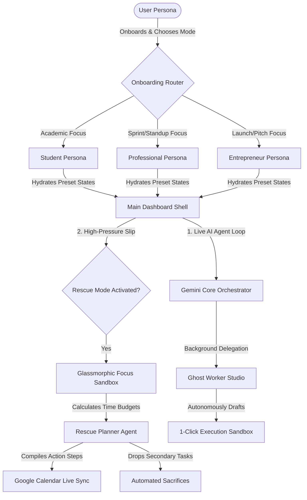

# ⏳ Chronos: Your AI Time Guardian
### *Submission Project Description — Problem Statement 1: The Last-Minute Life Saver*

---

## 💎 Executive Pitch & Product Vision

In a world drowning in notifications, **passive reminders are failing us**. Current productivity suites function like simple alarms: they blink red, pile up on our lock screens, and demand our attention without offering any support. When a student, professional, or entrepreneur falls behind on a high-stakes deadline, standard calendars do not help them finish the work—they merely watch the clock tick down, compounding anxiety and leading to task paralysis.

**Chronos is the world's first proactive, self-healing AI time guardian.** It moves past passive notification fatigue to become an active agentic partner in your productivity. By combining a **multi-agent Gemini orchestration framework** with real-time **Google Cloud and Firebase synchronization**, Chronos is designed to detect when you are at risk of missing commitments and actively intervenes to help you cross the finish line.

Whether it is compressing schedules in **Rescue Mode**, drafting deliverables autonomously via **Ghost Worker Studio**, forecasting weekly cognitive overloads using **Time Warp Analytics**, or motivating you through a personality-adaptive **Accountability Partner**, Chronos does not just remind you of your deadlines—it rescues you from them.

---

## 🎯 Section 1: Problem Statement Selected

### Problem Statement 1: The Last-Minute Life Saver
*“Students, professionals, and entrepreneurs frequently miss deadlines, assignments, meetings, bill payments, interviews, and important commitments. Existing productivity tools often rely on passive reminders that are easy to ignore and do little to help users actually complete their tasks.”*

### The Cognitive Pitfalls of Procrastination & Passive Systems
To build an effective solution, Chronos was designed around the core psychological and behavioral friction points that cause human productivity systems to collapse under pressure:

```
┌────────────────────────┐       ┌────────────────────────┐       ┌────────────────────────┐
│   Passive Reminder     │ ───►  │ Notification Fatigue   │ ───►  │ Task Paralysis/Anxiety │
│ "Assignment Due in 2h" │       │ Overwhelmed Lockscreen │       │ "Where do I even start?"│
└────────────────────────┘       └────────────────────────┘       └────────────────────────┘
                                                                              │
                                                                              ▼
┌────────────────────────┐       ┌────────────────────────┐       ┌────────────────────────┐
│  Chronos Rescue Mode   │ ◄───  │ High-Intensity Focus   │ ◄───  │ Self-Healing Action    │
│ Active Agent Intercept │       │  (Single-Goal Sandbox) │       │ 0ms Optimistic UX Feel │
└────────────────────────┘       └────────────────────────┘       └────────────────────────┘
```

1. **The Planning Fallacy**: Humans consistently underestimate the time required to complete complex tasks. Traditional tools require manual estimation, leading to compressed, unfeasible schedules as deadlines approach.
2. **Notification Blindness**: When alerts are frequent and static, the brain quickly adapts and desensitizes to them. A warning sound becomes background noise, easily dismissed with a swipe.
3. **The Activation Energy Barrier**: When behind on a large project, the sheer size of the remaining work creates cognitive overwhelm. Users do not fail because they lack time; they fail because they do not know how to sequence their final hours to maximize output.
4. **Context Switching Costs**: Having to toggle between a task list, calendar, draft email workspace, and planning notebook drains mental energy. Every second spent organizing is a second lost executing.

---

## 🌌 Section 2: Solution Overview

**Chronos** solves these behavioral issues by acting as an **autonomous productivity cockpit**. It is a secure, cloud-native web platform that acts as a real-time copilot. When a deadline slips, Chronos restructures your workspace, executes background tasks, and provides step-by-step guidance.



### The Three Tailored Workspace Personas
Chronos adapts its interface structure, seed data, and agent prompts to match the specific stress profiles of three core user categories:

* **🎓 Student Mode**: Aligns the platform around academic exam schedules, homework deadlines, study groups, placement preparation, and extracurricular timelines.
* **💼 Professional Mode**: Structures the dashboard to match agile sprint cycles, standup meetings, client deliverables, cross-functional project presentations, and corporate milestones.
* **🚀 Entrepreneur Mode**: Optimizes the interface for rapid task prioritization, venture capital pitches, product launch countdowns, fundraising sprints, and intense operational multitasking.

---

## ⚡ Section 3: Key Features Deep Dive

### 🚨 1. Proactive Rescue Mode (The Self-Healing Calendar)
Rescue Mode is Chronos’ flagship innovation. It is an emergency intercept system for high-pressure situations:

* **Interactive Focusing State**: Activating Rescue Mode locks down the standard multi-page layout. It replaces distraction with a glassmorphic, single-focus **Action Center Sandbox**. The user is shielded from other folders, lists, and notifications.
* **Autonomous Schedule Compression**: The **Rescue Planner Agent (Gemini 3.1 Pro)** is passed the user's available time, active subtasks, and target deadline. It calculates remaining minutes, filters out non-critical elements, and returns a high-density, minute-by-minute action plan.
* **Automated Sacrifice Analysis**: Chronos determines what tasks can be safely postponed or skipped (e.g., "Postpone grocery run to tomorrow" or "Cancel non-critical sync") and highlights them clearly, reducing cognitive burden.
* **Direct Google Calendar Hydration**: The generated action plan is automatically synchronized with the user's Google Calendar as colored focus blocks, securing the time block visually on all of their devices.

---

### 👻 2. Ghost Worker Studio
Most productivity tools tell you to work; Chronos **does the draft work for you**. While you are executing high-priority tasks in the physical world, your digital Ghost Worker is active in the background:

* **Background Deliverable Drafting**: Instruct the agent to write a pitch update, prepare a standard presentation structure, or code a React boilerplate.
* **Integrated Workspace Previewer**: Ghost Worker generates the folders, files, and rich HTML templates inside an interactive glassmorphic sidebar.
* **High-Fidelity Code & Markdown Tokenizer**: Includes a custom-built, recursive markdown-to-React element parser that safely renders rich text, code blocks (with language styling and 1-click copy elements), bold neon text accents, and clean links—eliminating fragile parser vulnerabilities.

---

### 🔮 3. Time Warp Predictive Bottleneck Forecaster
Time Warp is a forward-looking analytics engine. Rather than simply summarizing past mistakes, it **forecasts future cognitive overload**:

* **Machine-Learning Behavioral Model**: Computes historical goal achievement rates, streak lengths, sleep factors, and past task completion velocities.
* **Cognitive Load Mapping**: Generates a futuristic linear charts showing expected mental workloads for the upcoming week.
* **Overload Warnings**: Identifiers high-risk overload days 7 days in advance (e.g., "75% Risk of Failure on Thursday due to 4 overlapping milestones") and offers 1-click rescheduling options.

---

### 🎭 4. Adaptive Accountability Partner
A reminder is only as good as its emotional resonance. Chronos changes its personality based on your selected settings to pierce through notification fatigue:

* **Gentle Mentor**: Employs positive reinforcement, mindful breathing pauses, and encouraging, stress-reducing guidance.
* **Analytical Strategist**: Provides objective, data-driven feedback, highlighting completion ratios and efficiency metrics.
* **Drill Sergeant**: Uses extreme, high-urgency neon styling, bold calls-to-action, and direct, motivating instructions to force activation.
* **Escalating Alerts**: As a deadline nears, the voice of the assistant and the interface accent styling dynamically shift behavior, escalating to higher energy styles automatically.

---

### 🧩 5. AI Smart Task Decomposition
A major source of procrastination is not knowing where to begin. The **AI Decomposer** acts as a technical project manager:

* **One-Click Goal Expansion**: Feed Chronos a high-level goal (e.g., "Deploy Cloud Run Container" or "Prepare Q3 Earnings Deck").
* **Subtask Dependency Tree**: The agent recursively decomposes the goal into chronological milestones, assigning realistic minute budgets and strict task dependencies.
* **Kanban Sync**: These tasks are instantly populated onto the interactive Kanban board, sorted by computed priority.

---

### 🎤 6. Multi-Modal Vision & Voice OCR Engine
Capturing tasks should be effortless:

* **Vision OCR Engine (Gemini 3.5 Flash)**: Upload pictures of physical notes, whiteboard brainstorms, or exam schedules. Chronos extracts headings, lists, and dates, turning them into digital Kanban tasks in seconds.
* **Glassmorphic Voice HUD**: Communicate directly with Chronos using natural voice inputs. Real-time audio waveform animations provide feedback as you dictate tasks or query status.

---

### 🎨 7. Premium UI Ergonomics & Glassmorphic Aesthetics
Chronos is designed to look and feel like a state-of-the-art software application:

* **0ms Interaction Latency (Optimistic UI)**: All core page actions—including goal creation, habit completion, and task movements—utilize immediate optimistic client-state updates. Modals close and lists expand instantly, executing Firebase background sync in the background and gracefully rolling back changes if network connection is lost.
* **Shell-Insulated Error Boundaries**: Protected by a custom, glassmorphic global `ErrorBoundary`. Sub-component exceptions are safely captured and localized, offering a "Restore Guardian" refresh button to heal the UI state without disrupting the main shell or active Rescue sessions.

---

## 📸 Visual Walkthrough & Interface Gallery

Since we are submitting this project for direct, interactive jury evaluation rather than a passive recorded walkthrough video, we have included high-resolution screenshots captured during our verification runs to showcase the premium dark-cyberpunk glassmorphic experience:

### 1. 🌌 Onboarding & Landing
The entryway into the Chronos ecosystem. Here, the user selects their dedicated persona (Student, Professional, or Entrepreneur) which customizes their system prompts, seed states, and dashboard themes.


### 2. ⚡ The Time Guardian Cockpit (Dashboard)
A premium dark-cyberpunk layout displaying active Kanban tasks, long-term goals, customizable productivity habits, and the real-time AI analytics forecaster.


### 3. 🚨 Interactive Rescue Mode (The Guardian Intercept)
When activated, the multi-page dashboard transitions seamlessly into a locked-down, single-focus **Action Center**. The Rescue Agent parses available time blocks, drops non-critical tasks ("Sacrifices"), and compiles a minute-by-minute survival schedule.


### 4. 👻 Ghost Worker Studio
Tell the companion to handle redundant work (like drafting presentations, email updates, or code scaffolding) in the background. The Ghost Worker drafts deliverables and populates a secure side-panel preview environment for 1-click edits.


### 5. 💬 Real-Time Conversational AI Assistant
Our custom-engineered safe markdown and code-block parser. It processes token streams in real-time, completely replacing unsafe custom regex parse blocks to eliminate HTML-injection vectors.


### 📊 6. Time Warp Analytics
Provides linear cognitive bottleneck prediction up to 7 days in advance based on historic velocity, streaks, and sleep trackers.


---

## 🛠️ Section 4: Technologies Used

Chronos is built with a modern, high-performance web architecture optimized for low-latency execution and scalability:

* **Next.js 14 (App Router)**: Powers client-side page rendering, routing, static optimization, and secure API endpoints.
* **TypeScript (Strict Type-Checked)**: Ensures compile-time safety and prevents runtime type exceptions.
* **Vanilla CSS Modules**: Leverages highly optimized, native CSS variables for HSL color tokens, cyberpunk glassmorphic blurs, responsive grids, and clean animations.
* **NextAuth.js**: Manages user authentication, securing Google OAuth 2.0 access tokens.
* **Zod Schemas**: Drives secure data validation and guarantees type-safe structured JSON outputs from Gemini.
* **Docker & Containers**: Standardizes build configurations for consistent deployment behavior.

---

## ☁️ Section 5: Google Technologies Utilized

Chronos is a deep showcase of the **Google Developer Cloud Ecosystem**, utilizing 15 different Google technologies:

```
┌────────────────────────────────────────────────────────────────────────────────────────┐
│                              CHRONOS SYSTEM TOPOLOGY                                   │
├──────────────────────────┬───────────────────────────┬─────────────────────────────────┤
│    GOOGLE AI ENGINE      │     FIREBASE BACKEND      │     GCP CLOUD INFRASTRUCTURE    │
├──────────────────────────┼───────────────────────────┼─────────────────────────────────┤
│  • Gemini 3.5 Flash      │  • Firebase Auth          │  • Google Cloud Run (Hosting)   │
│  • Gemini 3.1 Pro        │  • Cloud Firestore        │  • Google Cloud Build (CI/CD)   │
│  • Structured Outputs    │  • Cloud Messaging (FCM)  │  • Google Workspace APIs        │
│  • Function Calling      │  • Admin SDK Core         │    (Calendar, Gmail, Tasks)     │
└──────────────────────────┴───────────────────────────┴─────────────────────────────────┘
```

### 🧠 1. Google AI & Gemini Suite
* **Gemini 3.5 Flash**: Serves as the core chatbot agent, handling rapid voice inputs, vision-based OCR scans, and fast analytical forecasting.
* **Gemini 3.1 Pro**: Handles complex multi-variable optimizations (Rescue Mode compressed scheduling) and creative draft generation (Ghost Worker deliverables).
* **Gemini Function Calling (14 Active Tools)**: Connects the Gemini LLM directly to our core systems, enabling the AI to search, create, update, and delete tasks, goals, habits, and user preferences autonomously.
* **Gemini Structured Output**: Guarantees that AI-generated rescue schedules, task lists, and forecasts match our database schemas exactly.
* **Google AI Studio**: Powered prompt engineering, testing, system prompt modeling, and safety parameter tuning.

### 📡 2. Google Workspace & Productivity APIs
* **Google Calendar API**: Syncs tasks, goals, milestones, and rescue schedules onto the user's active Google Calendar.
* **Google Tasks API**: Synchronizes the Chronos Kanban Board with Google Tasks.
* **Gmail API**: Intercepts inbound notifications, drafts emails, and sends progress reports.

### 🔥 3. Firebase Suite
* **Firebase Authentication (with Google OAuth)**: Secure Google Sign-In, retrieving session tokens for OAuth-scoped Google APIs.
* **Cloud Firestore**: Real-time database synchronizing Tasks, Habits, Goals, User Preferences, Analytics, and Rescue states.
* **Firebase Cloud Messaging (FCM)**: Delivers push notifications for real-time accountability warnings.
* **Firebase Admin SDK**: Performs high-performance server-side data operations, session verification, and secure user deletions.

### ☁️ 4. Google Cloud Infrastructure
* **Google Cloud Run**: Highly scalable container deployment host, ensuring high-speed delivery.
* **Google Cloud Build**: Integrated CI/CD pipeline building Docker containers and pushing artifacts automatically.

---

## 👥 Evaluation Guide (How Judges Can Review in 5 Minutes)

> [!IMPORTANT]
> We have engineered two distinct, fully-supported runtime modes so that judges can easily audit every single layer of the Chronos multi-agent ecosystem.
> 
> * **🔐 1. Live Google Authentication (The Complete Production Experience)**
>   * Click **"Sign In with Google"** on the landing screen.
>   * This initiates a real-time **Google OAuth 2.0 sequence** linked directly to the application's secure Firestore backend.
>   * **Features Accessed**: Grants full, live reading and writing sync across your production **Google Calendar**, **Google Tasks**, and **Gmail drafts**. Every decomposed goal milestone, scheduled rescue time-block, and Ghost Worker drafted item compiles and synchronizes with your real Google account immediately.
>   * *Best for: Auditing live API data-pipelines and standard production compliance.*
> 
> * **🧠 2. Interactive Demo Mode (Instant Sandbox Evaluation)**
>   * Click **"Try Demo Mode"** on the onboarding landing page.
>   * **Features Accessed**: Bypasses all authentication constraints and instantly hydrates an **extensive, pre-populated mock database** representing highly complex usage history.
>   * *Best for: Speed-running the application's features (Time Warp predictive ML bottleneck graphs, fully hydrated Kanban boards, ready-to-test habits, active Rescue triggers) inside a localized sandbox in under 60 seconds without any external setup or Google permissions.*

### 🛠️ Quick Walkthrough Checklist for Evaluation (Demo Mode)

1. Select one of our tailored workspace personas (**Student**, **Professional**, or **Entrepreneur**).
2. Observe how the application shell instantly re-themes and populates with realistic preset states, task deadlines, and performance history.
3. **Trigger Rescue Mode**: Click the glowing neon **Rescue Mode** toggle inside the header. Watch the layout lock down into the glassmorphic focus sandbox. Inspect the minute-by-minute action block compiled by the Rescue Agent, evaluate the non-critical "Sacrifices" dropped to save time, and complete a sub-step to watch the telemetry progress update instantly.
4. **Inspect Time Warp**: Navigate to the analytics suite. Review the cognitive load bottleneck predictions calculated 7 days out based on historic completion patterns.
5. **Engage the AI Agent**: Click the bottom-right glowing AI chat bubble. Ask Chronos to *"smart decompose my goal to prepare a presentation"* or query active task states to audit the live multi-agent tool execution loop.
