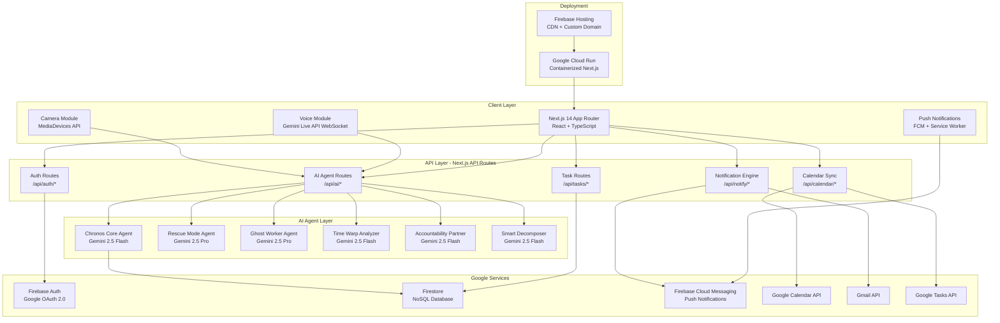

# Chronos — The Last-Minute Life Saver

> **Your AI Time Guardian** — An autonomous productivity agent that doesn't just remind you, it rescues you.

## Executive Summary

Chronos is a **full-stack, agentic AI productivity platform** that goes far beyond traditional to-do apps. While most competitors will build "chatbot + task list" wrappers, Chronos is a **proactive, autonomous agent** that detects when you're about to miss a deadline and intervenes with a compressed rescue plan, autonomously drafts deliverables, predicts future bottlenecks from your behavior patterns, and adapts its personality to your work style.

**The 3-second pitch for judges:** *"Chronos doesn't remind you about deadlines — it saves you from missing them."*

---

## Why Chronos Wins

| Evaluation Criteria | Weight | Our Strategy |
|---|---|---|
| **Problem Solving & Impact** | 20% | Multi-mode (Student/Professional/Entrepreneur) with Rescue Mode that generates compressed action plans when deadlines approach |
| **Agentic Depth** | 20% | 5 autonomous agent modules: Rescue Mode, Ghost Worker, Time Warp, Accountability Partner, Smart Decomposition — all using Gemini function calling + Interactions API |
| **Innovation & Creativity** | 20% | Personality-adaptive AI, predictive bottleneck detection, camera-based document scanning, gamification with XP/levels/streaks |
| **Google Technologies** | 15% | Gemini 2.5 Flash/Pro, Gemini Live API (voice), Firebase Auth/Firestore/FCM, Google Calendar/Gmail/Tasks APIs, Cloud Run, Firebase AI Logic |
| **Product Experience & Design** | 10% | Dark cyberpunk aesthetic with neon accents, glassmorphism, micro-animations, guided demo tour |
| **Technical Implementation** | 10% | Next.js 14+ on Cloud Run, real-time WebSocket updates, multi-channel notifications, structured output with Zod schemas |
| **Completeness & Usability** | 5% | Full onboarding flow, demo mode with pre-populated data, responsive mobile design |

---

## User Review Required

> [!IMPORTANT]
> **Google Cloud Billing**: You'll need a GCP project with billing enabled for Cloud Run deployment, Gemini API, and Firebase services. The free tier covers most hackathon usage, but ensure billing is set up.

> [!IMPORTANT]
> **API Keys Required**: You need to create credentials for:
> 1. Gemini API key (from Google AI Studio)
> 2. Google OAuth 2.0 Client ID (for Calendar/Gmail/Tasks integration)
> 3. Firebase project configuration
> 4. FCM (Firebase Cloud Messaging) server key

> [!WARNING]
> **Scope Management**: This is an ambitious feature set for 5 days. The plan is designed with a **priority ordering** — build the core dashboard + AI chat + Rescue Mode first, then layer on features. Each feature is modular and can be skipped without breaking the app.

---

## Resolved Decisions

> [!TIP]
> **Q1 — GCP Project**: ✅ GCP project with billing is ready. Proceed with Cloud Run deployment directly.

> [!TIP]
> **Q2 — Demo Scenario**: ✅ **Mixed demo covering all 3 modes**. Demo data must include:
> - **Student persona**: Exams, assignments, campus placements, project deadlines
> - **Professional persona**: Sprint deadlines, client meetings, performance review prep
> - **Entrepreneur persona**: Investor pitch, product launch, hiring tasks, marketing campaigns
> 
> Demo mode should let the user/judge switch between modes to see tailored AI behavior for each.

> [!TIP]
> **Q3 — Model Strategy**: ✅ **Gemini 2.5 Flash** for core chat, quick analysis, camera vision. **Gemini 2.5 Pro** for Rescue Mode planning, Ghost Worker drafts, and Smart Decomposition. This optimizes cost + latency while using Pro for high-value agent operations.

---

## System Architecture Overview



---

## Proposed Changes

### Component 1: Project Foundation & Configuration

#### [NEW] package.json
```json
{
  "name": "chronos",
  "version": "1.0.0",
  "private": true,
  "scripts": {
    "dev": "next dev",
    "build": "next build",
    "start": "next start",
    "lint": "next lint"
  },
  "dependencies": {
    "next": "^14.2.0",
    "react": "^18.3.0",
    "react-dom": "^18.3.0",
    "@google/generative-ai": "^0.21.0",
    "firebase": "^11.0.0",
    "firebase-admin": "^12.0.0",
    "googleapis": "^140.0.0",
    "zod": "^3.23.0",
    "framer-motion": "^11.0.0",
    "recharts": "^2.12.0",
    "date-fns": "^3.6.0",
    "lucide-react": "^0.400.0",
    "next-auth": "^4.24.0",
    "uuid": "^9.0.0"
  },
  "devDependencies": {
    "@types/node": "^20.0.0",
    "@types/react": "^18.3.0",
    "@types/react-dom": "^18.3.0",
    "typescript": "^5.5.0",
    "eslint": "^8.57.0",
    "eslint-config-next": "^14.2.0"
  }
}
```

#### [NEW] .env.local (template)
```env
# Gemini API
GEMINI_API_KEY=your_gemini_api_key
GEMINI_MODEL_FLASH=gemini-2.5-flash
GEMINI_MODEL_PRO=gemini-2.5-pro

# Firebase
NEXT_PUBLIC_FIREBASE_API_KEY=
NEXT_PUBLIC_FIREBASE_AUTH_DOMAIN=
NEXT_PUBLIC_FIREBASE_PROJECT_ID=
NEXT_PUBLIC_FIREBASE_STORAGE_BUCKET=
NEXT_PUBLIC_FIREBASE_MESSAGING_SENDER_ID=
NEXT_PUBLIC_FIREBASE_APP_ID=
FIREBASE_SERVICE_ACCOUNT_KEY=  # base64 encoded

# Google OAuth
GOOGLE_CLIENT_ID=
GOOGLE_CLIENT_SECRET=

# NextAuth
NEXTAUTH_SECRET=
NEXTAUTH_URL=http://localhost:3000

# FCM
NEXT_PUBLIC_FIREBASE_VAPID_KEY=
```

#### [NEW] Dockerfile
```dockerfile
FROM node:20-alpine AS builder
WORKDIR /app
COPY package*.json ./
RUN npm ci
COPY . .
RUN npm run build

FROM node:20-alpine AS runner
WORKDIR /app
ENV NODE_ENV=production
COPY --from=builder /app/.next/standalone ./
COPY --from=builder /app/.next/static ./.next/static
COPY --from=builder /app/public ./public
EXPOSE 3000
ENV PORT=3000
CMD ["node", "server.js"]
```

#### [NEW] next.config.js
```javascript
/** @type {import('next').NextConfig} */
const nextConfig = {
  output: 'standalone', // Required for Cloud Run deployment
  images: {
    remotePatterns: [
      { protocol: 'https', hostname: 'lh3.googleusercontent.com' },
    ],
  },
  experimental: {
    serverActions: { bodySizeLimit: '10mb' },
  },
};
module.exports = nextConfig;
```

---

### Component 2: Design System & Global Styles

#### [NEW] src/app/globals.css
The design system implements a **dark cyberpunk aesthetic** with neon accents:

**Design Tokens:**
- `--bg-primary`: `#0a0a0f` (deep space black)
- `--bg-secondary`: `#12121a` (elevated surfaces)
- `--bg-tertiary`: `#1a1a2e` (cards and panels)
- `--neon-cyan`: `#00f5ff` (primary accent)
- `--neon-purple`: `#a855f7` (secondary accent)
- `--neon-pink`: `#ec4899` (urgent/danger)
- `--neon-green`: `#22c55e` (success/completed)
- `--neon-amber`: `#f59e0b` (warning)
- `--glass-bg`: `rgba(255, 255, 255, 0.03)` (glassmorphism)
- `--glass-border`: `rgba(255, 255, 255, 0.08)`

**Key CSS Features:**
- Glassmorphism cards with `backdrop-filter: blur(20px)`
- Neon glow effects using `box-shadow` with accent colors
- Smooth `@keyframes` for pulse, float, and shimmer animations
- CSS custom properties for theming consistency
- Responsive grid system with CSS Grid + Flexbox
- Custom scrollbar styling
- Font: Google Fonts `Inter` (body) + `JetBrains Mono` (code/numbers)

**Utility Classes:**
- `.glass-card` — Glassmorphism container
- `.neon-border` — Animated neon border glow
- `.neon-text` — Text with neon glow
- `.pulse-dot` — Animated status indicator
- `.shimmer` — Loading skeleton animation
- `.slide-up` — Entry animation
- `.glow-button` — CTA buttons with neon hover effect

---

### Component 3: Firebase Configuration

#### [NEW] src/lib/firebase.ts
Client-side Firebase initialization:
- Firebase Auth (Google provider)
- Firestore instance
- FCM messaging instance
- Helper functions: `signInWithGoogle()`, `signOut()`, `onAuthChange()`

#### [NEW] src/lib/firebase-admin.ts
Server-side Firebase Admin SDK:
- Initialized from `FIREBASE_SERVICE_ACCOUNT_KEY` env var
- Admin Firestore access for server-side operations
- FCM admin for sending push notifications

#### Firestore Data Model

```
users/
  {userId}/
    profile: {
      displayName: string
      email: string
      photoURL: string
      mode: 'student' | 'professional' | 'entrepreneur'
      personality: {
        workStyle: 'sprinter' | 'marathoner' | 'mixed'
        motivationType: 'encouragement' | 'pressure' | 'data-driven'
        communicationStyle: 'casual' | 'professional' | 'minimal'
        timezone: string
        peakHours: number[]  // e.g., [9, 10, 14, 15]
      }
      preferences: {
        gamificationEnabled: boolean
        ghostWorkerEnabled: boolean
        rescueModeEnabled: boolean
        voiceEnabled: boolean
        notificationChannels: ('push' | 'email' | 'inApp')[]
      }
      onboardingCompleted: boolean
      createdAt: Timestamp
    }
    
    gamification: {
      xp: number
      level: number
      streak: number
      longestStreak: number
      badges: string[]
      tasksCompletedToday: number
      totalTasksCompleted: number
    }

    tasks/
      {taskId}: {
        title: string
        description: string
        status: 'todo' | 'in_progress' | 'completed' | 'overdue' | 'rescued'
        priority: 'critical' | 'high' | 'medium' | 'low'
        deadline: Timestamp
        estimatedMinutes: number
        actualMinutes: number
        category: string
        tags: string[]
        subtasks: { id: string, title: string, completed: boolean }[]
        aiGenerated: boolean
        parentGoalId: string | null
        rescuePlan: { ... } | null
        ghostWorkerOutput: { ... } | null
        createdAt: Timestamp
        completedAt: Timestamp | null
      }
    
    goals/
      {goalId}: {
        title: string
        description: string
        deadline: Timestamp
        progress: number  // 0-100
        milestones: { id: string, title: string, completed: boolean, dueDate: Timestamp }[]
        linkedTaskIds: string[]
        status: 'active' | 'completed' | 'abandoned'
      }

    habits/
      {habitId}: {
        title: string
        frequency: 'daily' | 'weekly' | 'custom'
        completedDates: string[]  // YYYY-MM-DD
        streak: number
        category: string
      }

    analytics/
      {dateKey}: {  // e.g., "2026-06-24"
        tasksCompleted: number
        tasksCreated: number
        focusMinutes: number
        rescueModeActivations: number
        productivityScore: number  // AI-calculated 0-100
        bottlenecksDetected: string[]
      }

    conversations/
      {conversationId}: {
        messages: { role: 'user' | 'ai', content: string, timestamp: Timestamp }[]
        context: string  // Current conversation context
      }
```

---

### Component 4: Gemini AI Agent System

This is the **core differentiator**. Each agent is a specialized Gemini instance with function calling.

#### [NEW] src/lib/ai/gemini-client.ts
Central Gemini client configuration:
- Initialize `GoogleGenerativeAI` with API key
- Model factory: `getFlashModel()`, `getProModel()`
- System instruction templates per agent type
- Structured output schemas using Zod

#### [NEW] src/lib/ai/agents/core-agent.ts
**The Chronos Core Agent** — The main conversational AI that orchestrates all other agents.

**System Prompt:**
```
You are Chronos, an AI Time Guardian. You are proactive, context-aware, and 
personality-adaptive. You don't just manage tasks — you rescue users from 
missed deadlines.

Current user mode: {student|professional|entrepreneur}
User personality: {workStyle}, motivated by {motivationType}
Communication style: {communicationStyle}

Today's date: {currentDate}
User's timezone: {timezone}

You have access to the following tools:
- createTask: Create a new task with priority and deadline
- updateTask: Update task status, priority, or details
- deleteTask: Remove a task
- getUpcomingDeadlines: Fetch tasks due within N hours
- triggerRescueMode: Activate Rescue Mode for a critical deadline
- triggerGhostWorker: Autonomously draft a deliverable
- analyzeProductivity: Get productivity insights
- createCalendarEvent: Add event to Google Calendar
- sendReminder: Send push/email notification
- decompose Goal: Break a goal into actionable tasks
- getWeatherContext: Get contextual info for scheduling

When the user seems stressed or mentions urgency, proactively suggest 
Rescue Mode. When they mention needing to write/draft something, offer 
Ghost Worker. Always be anticipatory, not reactive.
```

**Function Calling Schema (Zod):**
```typescript
const CreateTaskSchema = z.object({
  title: z.string().describe("Task title"),
  description: z.string().describe("Task description"),
  priority: z.enum(["critical", "high", "medium", "low"]),
  deadline: z.string().describe("ISO 8601 deadline"),
  estimatedMinutes: z.number().describe("Estimated time in minutes"),
  category: z.string().describe("Task category"),
  tags: z.array(z.string()),
  subtasks: z.array(z.object({
    title: z.string(),
    estimatedMinutes: z.number()
  })).optional()
});
```

#### [NEW] src/lib/ai/agents/rescue-agent.ts
**Rescue Mode Agent** — Uses Gemini 2.5 Pro for complex planning.

When activated (manually or auto-triggered when deadline is <6 hours away):
1. Analyzes all remaining subtasks and their estimated times
2. Generates a **compressed action plan** with exact time blocks
3. Identifies what can be skipped/simplified without critical impact
4. Creates a "focus mode" that blocks non-essential tasks
5. Provides real-time guidance as the user works through the plan

**Output Schema:**
```typescript
const RescuePlanSchema = z.object({
  severity: z.enum(["yellow", "orange", "red"]),  // How close to deadline
  totalMinutesAvailable: z.number(),
  totalMinutesNeeded: z.number(),
  feasible: z.boolean(),
  plan: z.array(z.object({
    timeBlock: z.string(),  // "4:00 PM - 4:30 PM"
    action: z.string(),
    estimatedMinutes: z.number(),
    tips: z.string(),
    canBeSkipped: z.boolean()
  })),
  sacrifices: z.array(z.string()),  // What to skip/simplify
  motivationalMessage: z.string(),
  checkpoints: z.array(z.object({
    time: z.string(),
    milestone: z.string()
  }))
});
```

#### [NEW] src/lib/ai/agents/ghost-worker-agent.ts
**Ghost Worker Agent** — Autonomously drafts deliverables.

Capabilities:
- Draft emails (using context from task description)
- Generate document outlines
- Create presentation structures
- Write code snippets/boilerplate
- Prepare meeting agendas

The user can review, edit, and approve Ghost Worker outputs before they are sent/saved. All outputs are clearly marked as AI-generated.

**Toggle:** Users can enable/disable this per-task or globally.

#### [NEW] src/lib/ai/agents/timewarp-agent.ts
**Time Warp Agent** — Predictive bottleneck detection.

Analyzes:
- Historical task completion patterns (from Firestore analytics)
- Current task load vs. available time
- Past procrastination patterns (tasks completed last-minute)
- Calendar density analysis

**Output:** A "Bottleneck Forecast" showing:
- Predicted high-stress days in the next 7 days
- Tasks likely to be procrastinated based on past behavior
- Recommended pre-emptive actions

#### [NEW] src/lib/ai/agents/accountability-agent.ts
**Accountability Partner Agent** — Adapts communication style.

Based on user personality profile:
- **Encourager**: "Great progress! You're 70% done, keep the momentum!"
- **Drill Sergeant**: "You have 3 hours left. No excuses. Start NOW."
- **Data Analyst**: "Based on your velocity, you need 2.5hrs. You have 4hrs available. Efficiency target: 62%."

The agent escalates tone automatically as deadlines approach.

#### [NEW] src/lib/ai/agents/decomposer-agent.ts
**Smart Decomposition Agent** — Breaks goals into micro-tasks.

Input: A high-level goal (e.g., "Prepare for final exams")
Output: A structured task tree with:
- Milestones with due dates
- Individual tasks with time estimates
- Dependencies between tasks
- Priority ordering using topological sort
- Calendar integration suggestions

---

### Component 5: Next.js App Structure

#### [NEW] src/app/layout.tsx
Root layout with:
- Google Fonts (Inter, JetBrains Mono) via `next/font`
- Global CSS import
- Firebase Auth context provider
- Theme provider (dark mode by default)
- SEO meta tags
- Service Worker registration for FCM

#### [NEW] src/app/page.tsx
Landing page (unauthenticated):
- Hero section with animated Chronos logo
- Feature showcase with scroll animations
- "Start Demo" and "Sign In" CTAs
- Testimonial/social proof section (with sample data)

#### [NEW] src/app/(auth)/login/page.tsx
Login page:
- Google Sign-In button (Firebase Auth)
- "Try Demo Mode" button (bypasses auth with sample data)
- Animated background with floating time particles

#### [NEW] src/app/(app)/layout.tsx
Authenticated app shell:
- Sidebar navigation (collapsible)
- Top bar with user avatar, notifications bell, search (Cmd+K)
- AI Chat sidebar (persistent, toggleable)
- Cmd+K command palette overlay

#### [NEW] src/app/(app)/onboarding/page.tsx
First-time user experience:
1. **Welcome Screen**: Animated Chronos introduction
2. **Mode Selection**: Student / Professional / Entrepreneur (with visual cards)
3. **Personality Quiz**: 5-7 quick questions to determine:
   - Work style (sprinter vs. marathoner)
   - Motivation type (encouragement vs. pressure vs. data)
   - Communication preference (casual vs. professional)
4. **Integration Setup**: Connect Google Calendar, Gmail (optional)
5. **Feature Preferences**: Toggle Ghost Worker, Gamification, etc.
6. **AI Interview**: Chronos asks 2-3 follow-up questions about goals

The AI interview uses Gemini to generate personalized follow-up questions based on quiz answers.

#### [NEW] src/app/(app)/dashboard/page.tsx
**Main Dashboard** — The heart of Chronos.

Layout (responsive grid):
```
┌─────────────────────────────────────────────────────────────┐
│ ⏰ Chronos Status Bar (active rescue modes, next deadline) │
├───────────────────────────────┬─────────────────────────────┤
│                               │                             │
│  📋 Today's Priority Tasks    │  🤖 AI Chat Sidebar         │
│  (sorted by AI priority)     │  (persistent, contextual)   │
│                               │                             │
│  📊 Productivity Ring         │  Voice input button          │
│  (daily progress)            │  Camera scan button          │
│                               │                             │
├───────────────────────────────┤  Quick actions:             │
│                               │  - "Plan my day"            │
│  🔥 Rescue Mode Alerts       │  - "What should I do next?" │
│  (if any active)             │  - "Break down [goal]"      │
│                               │                             │
├───────────────────────────────┤                             │
│                               │                             │
│  ⚡ Time Warp Forecast        │                             │
│  (next 7-day bottleneck      │                             │
│   prediction graph)          │                             │
│                               │                             │
├───────────────────────────────┤                             │
│                               │                             │
│  🎮 Gamification Bar         │                             │
│  (XP, Level, Streak)         │                             │
│                               │                             │
└───────────────────────────────┴─────────────────────────────┘
```

#### [NEW] src/app/(app)/tasks/page.tsx
Task management page:
- Kanban board view (Todo → In Progress → Completed)
- List view with filters (priority, category, deadline)
- Calendar view (monthly/weekly)
- Quick add with AI auto-categorization
- Drag-and-drop reordering
- Bulk actions

#### [NEW] src/app/(app)/goals/page.tsx
Goals & habits page:
- Active goals with progress bars
- Milestone timeline visualization
- Habit tracker with calendar heatmap
- "New Goal" flow with Smart Decomposition

#### [NEW] src/app/(app)/analytics/page.tsx
Analytics dashboard:
- Productivity score over time (line chart)
- Task completion rate (donut chart)
- Focus time distribution (bar chart)
- Category breakdown (pie chart)
- Streak calendar (GitHub-style heatmap)
- AI-generated weekly insights panel
- Export as PDF button

#### [NEW] src/app/(app)/rescue/[taskId]/page.tsx
Rescue Mode full-screen view:
- Countdown timer to deadline
- Step-by-step action plan with progress checkboxes
- Current step highlighted with timer
- Distraction-free mode (minimal UI, no sidebar)
- Checkpoint notifications
- "I'm done!" and "I need more time" buttons

#### [NEW] src/app/(app)/settings/page.tsx
Settings page:
- Profile & mode settings
- Personality recalibration
- Integration management (Calendar, Gmail)
- Notification preferences
- Feature toggles (Ghost Worker, Gamification, etc.)
- Data export

---

### Component 6: Core UI Components

#### [NEW] src/components/ui/GlassCard.tsx
Glassmorphism card component with:
- Configurable glow color (cyan/purple/pink/green)
- Hover lift animation (framer-motion)
- Optional neon border animation

#### [NEW] src/components/ui/NeonButton.tsx
CTA button with:
- Neon glow on hover
- Ripple click effect
- Loading state with shimmer
- Variants: primary (cyan), danger (pink), success (green)

#### [NEW] src/components/ui/AnimatedCounter.tsx
Animated number counter for stats (XP, tasks completed, etc.)

#### [NEW] src/components/ui/ProgressRing.tsx
Circular progress indicator with:
- SVG-based ring with gradient stroke
- Animated fill on mount
- Center label (percentage or custom)

#### [NEW] src/components/ui/CommandPalette.tsx
Cmd+K command palette:
- Fuzzy search across tasks, goals, and AI commands
- Quick actions: "Create task", "Start Rescue Mode", "Plan my day"
- Keyboard navigation

#### [NEW] src/components/ui/Toast.tsx
Notification toast system:
- Slide-in from top-right
- Variants: info (cyan), success (green), warning (amber), error (pink)
- Auto-dismiss with progress bar

---

### Component 7: Feature Components

#### [NEW] src/components/chat/AIChatSidebar.tsx
Persistent AI chat panel:
- Message history with user/AI bubbles
- Markdown rendering in AI responses
- Voice input button (triggers Gemini Live API)
- Camera button (opens camera for document scan)
- Typing indicator with shimmer animation
- Quick action chips at bottom
- Resizable panel width

#### [NEW] src/components/chat/VoiceInput.tsx
Voice interaction component:
- Uses Web Audio API to capture microphone input
- Connects to Gemini Live API via WebSocket for real-time conversation
- Visual waveform animation during recording
- Barge-in support (interrupt AI mid-response)
- Fallback to Web Speech API if Live API unavailable

#### [NEW] src/components/chat/CameraScanner.tsx
Camera document scanner:
- Uses `navigator.mediaDevices.getUserMedia` for camera access
- Captures photo → sends to Gemini 2.5 Flash with vision
- AI extracts text, tasks, and deadlines from photos of:
  - Whiteboards
  - Handwritten notes
  - Printed documents
  - Screenshots
- Extracted items are offered as task suggestions

#### [NEW] src/components/tasks/TaskCard.tsx
Individual task card with:
- Priority indicator (color-coded left border)
- Deadline countdown ("2h 30m left")
- Progress bar for subtasks
- Quick actions: complete, edit, delete, rescue
- Rescue Mode glow animation when approaching deadline
- Ghost Worker badge if AI-generated content available

#### [NEW] src/components/tasks/TaskKanban.tsx
Kanban board:
- Three columns: Todo, In Progress, Completed
- Drag-and-drop between columns (HTML5 Drag API)
- Column task count badges
- Empty state illustrations

#### [NEW] src/components/rescue/RescueModeView.tsx
Full-screen rescue experience:
- Dark overlay with focused content
- Countdown timer with neon glow
- Step-by-step checklist with time estimates
- Current step timer
- Progress percentage
- Motivational messages from Accountability Partner
- "Checkpoint reached!" celebrations

#### [NEW] src/components/analytics/ProductivityChart.tsx
Recharts-based analytics:
- Line chart: productivity score over 30 days
- Bar chart: daily focus minutes
- Donut chart: task completion rate
- Heatmap: streak calendar (custom SVG)

#### [NEW] src/components/gamification/XPBar.tsx
Gamification progress bar:
- Current XP / Next level XP
- Level badge with neon glow
- Streak fire icon with animation
- Recent badge unlocks

#### [NEW] src/components/onboarding/PersonalityQuiz.tsx
Multi-step quiz with:
- Animated transitions between questions
- Visual option cards (not boring radio buttons)
- Progress indicator
- AI-powered follow-up question generation

#### [NEW] src/components/demo/DemoTour.tsx
Guided tour for judges/new users:
- Spotlight overlay highlighting features
- Step-by-step walkthrough with tooltips
- Pre-populated data showcasing all features
- "Skip tour" option
- Auto-progresses with timeout

---

### Component 8: API Routes

#### [NEW] src/app/api/auth/[...nextauth]/route.ts
NextAuth.js configuration:
- Google OAuth provider with Calendar, Gmail, Tasks scopes
- JWT session strategy
- Token refresh handling for Google API access
- User profile creation in Firestore on first sign-in

#### [NEW] src/app/api/ai/chat/route.ts
Main AI chat endpoint:
- POST: Send message to Chronos Core Agent
- Handles function calling loop (execute tool → return result → get next response)
- Streams response using ReadableStream for real-time UI updates
- Maintains conversation history in Firestore

#### [NEW] src/app/api/ai/rescue/route.ts
Rescue Mode endpoint:
- POST: Activate Rescue Mode for a task
  - Fetches task details + subtasks
  - Calls Rescue Agent with current time + deadline
  - Returns structured RescuePlan
- GET: Fetch active rescue plans
- PATCH: Update rescue plan progress

#### [NEW] src/app/api/ai/ghost-worker/route.ts
Ghost Worker endpoint:
- POST: Generate deliverable draft
  - Input: task context, deliverable type (email, document, etc.)
  - Output: Generated draft with metadata
- PATCH: User edits/approves draft

#### [NEW] src/app/api/ai/analyze/route.ts
Analytics AI endpoint:
- GET: Generate AI productivity insights
  - Fetches last 30 days of analytics data
  - Calls Time Warp Agent for bottleneck prediction
  - Returns insights + forecast

#### [NEW] src/app/api/ai/decompose/route.ts
Goal decomposition endpoint:
- POST: Break goal into tasks
  - Input: goal description, deadline
  - Output: Structured task tree with estimates and dependencies

#### [NEW] src/app/api/ai/voice/route.ts
Voice session management:
- POST: Initialize Gemini Live API WebSocket session
- Returns WebSocket connection details for client

#### [NEW] src/app/api/ai/scan/route.ts
Camera scan processing:
- POST: Accept base64 image
- Send to Gemini 2.5 Flash with vision
- Extract text, tasks, deadlines
- Return structured extraction results

#### [NEW] src/app/api/tasks/route.ts
CRUD for tasks:
- GET: Fetch tasks with filters (status, priority, deadline range)
- POST: Create task
- PATCH: Update task
- DELETE: Delete task

#### [NEW] src/app/api/goals/route.ts
CRUD for goals + habits

#### [NEW] src/app/api/calendar/sync/route.ts
Google Calendar integration:
- GET: Fetch upcoming events
- POST: Create calendar event from task
- Bi-directional sync: Calendar events → Chronos tasks

#### [NEW] src/app/api/notifications/route.ts
Notification engine:
- Scheduled endpoint (called by Cloud Scheduler or cron):
  - Check all users for approaching deadlines
  - Auto-trigger Rescue Mode if enabled and deadline < 6 hours
  - Send push notifications via FCM
  - Send email reminders via Gmail API

#### [NEW] src/app/api/analytics/route.ts
Analytics data:
- GET: Fetch analytics for date range
- POST: Log productivity event (task completed, focus session, etc.)
- GET /export: Generate PDF report (using jsPDF or server-side generation)

---

### Component 9: Hooks & Utilities

#### [NEW] src/hooks/useAuth.ts
Authentication hook:
- Current user state
- Loading/error states
- Sign in/out functions
- Google API token access

#### [NEW] src/hooks/useTasks.ts
Task management hook:
- Real-time Firestore subscription for tasks
- CRUD operations with optimistic updates
- Filter/sort state management

#### [NEW] src/hooks/useAIChat.ts
AI chat hook:
- Message state management
- Streaming response handling
- Function call execution
- Voice/camera integration triggers

#### [NEW] src/hooks/useVoice.ts
Voice interaction hook:
- Microphone permissions
- WebSocket connection to Gemini Live API
- Audio recording/streaming state
- Text response callback

#### [NEW] src/hooks/useCommandPalette.ts
Cmd+K hook:
- Open/close state
- Search query
- Filtered results
- Action execution

#### [NEW] src/hooks/useNotifications.ts
Notification hook:
- FCM token management
- Permission request
- In-app notification state

#### [NEW] src/lib/utils/priority.ts
Priority calculation utilities:
- Eisenhower Matrix categorization
- Urgency score based on deadline proximity
- AI priority override integration

#### [NEW] src/lib/utils/gamification.ts
Gamification utilities:
- XP calculation per action type
- Level thresholds
- Badge unlock conditions
- Streak calculation

---

### Component 10: Demo Mode

#### [NEW] src/lib/demo/demo-data.ts
Pre-populated demo data for judges:

**Demo User Profile:**
- Name: "Demo User" (Student mode)
- Personality: Sprinter, motivated by pressure, casual communication

**Demo Tasks (15+ tasks across various states):**
- 3 overdue tasks (shows Rescue Mode trigger)
- 5 tasks due today (varying priorities)
- 4 tasks due this week
- 3 completed tasks (shows progress)

**Demo Goals:**
- "Complete Final Year Project" — 65% progress, 5 milestones
- "Prepare for Campus Placements" — 30% progress

**Demo Analytics (30 days):**
- Realistic productivity score fluctuations
- Streak of 12 days
- Category distribution data

**Demo Conversation:**
- Pre-loaded AI chat showing Chronos's personality
- Example Rescue Mode activation
- Example Ghost Worker draft

#### [NEW] src/lib/demo/demo-context.tsx
React context that wraps the entire app in demo mode:
- Intercepts Firestore calls and returns demo data
- Intercepts AI calls and returns pre-scripted responses (with delay for realism)
- Shows "Demo Mode" badge in the UI
- "Exit Demo" button

---

### Component 11: PWA & Notifications

#### [NEW] public/manifest.json
PWA manifest for installable web app:
- App name: "Chronos"
- Theme color: `#0a0a0f`
- Background color: `#0a0a0f`
- Display: standalone
- Icons: 192px, 512px

#### [NEW] public/firebase-messaging-sw.js
Service worker for background push notifications:
- FCM message handling
- Notification display with Chronos branding
- Click-to-open task deep links

---

### Component 12: Deployment Configuration

#### [NEW] cloudbuild.yaml
Google Cloud Build config:
```yaml
steps:
  - name: 'gcr.io/cloud-builders/docker'
    args: ['build', '-t', 'gcr.io/$PROJECT_ID/chronos', '.']
  - name: 'gcr.io/cloud-builders/docker'
    args: ['push', 'gcr.io/$PROJECT_ID/chronos']
  - name: 'gcr.io/google.com/cloudsdktool/cloud-sdk'
    args:
      - 'run'
      - 'deploy'
      - 'chronos'
      - '--image=gcr.io/$PROJECT_ID/chronos'
      - '--region=asia-south1'
      - '--platform=managed'
      - '--allow-unauthenticated'
      - '--memory=1Gi'
      - '--cpu=1'
      - '--min-instances=0'
      - '--max-instances=10'
      - '--set-env-vars=NODE_ENV=production'
    entrypoint: gcloud
```

#### Deployment Steps:
1. Create GCP project + enable Cloud Run, Cloud Build APIs
2. Create Firebase project linked to GCP project
3. Enable Gemini API in Google AI Studio, get API key
4. Set up Google OAuth consent screen + credentials
5. Enable Google Calendar, Gmail, Tasks APIs
6. Deploy: `gcloud builds submit --config cloudbuild.yaml`
7. Set environment variables in Cloud Run console
8. Configure custom domain via Firebase Hosting (optional)

---

## File Structure Summary

```
chronos/
├── public/
│   ├── manifest.json
│   ├── firebase-messaging-sw.js
│   ├── icons/
│   └── fonts/
├── src/
│   ├── app/
│   │   ├── globals.css
│   │   ├── layout.tsx
│   │   ├── page.tsx                    # Landing page
│   │   ├── (auth)/
│   │   │   └── login/page.tsx
│   │   ├── (app)/
│   │   │   ├── layout.tsx              # App shell
│   │   │   ├── onboarding/page.tsx
│   │   │   ├── dashboard/page.tsx      # Main dashboard
│   │   │   ├── tasks/page.tsx          # Task management
│   │   │   ├── goals/page.tsx          # Goals & habits
│   │   │   ├── analytics/page.tsx      # Analytics dashboard
│   │   │   ├── rescue/[taskId]/page.tsx # Rescue Mode
│   │   │   └── settings/page.tsx
│   │   └── api/
│   │       ├── auth/[...nextauth]/route.ts
│   │       ├── ai/
│   │       │   ├── chat/route.ts
│   │       │   ├── rescue/route.ts
│   │       │   ├── ghost-worker/route.ts
│   │       │   ├── analyze/route.ts
│   │       │   ├── decompose/route.ts
│   │       │   ├── voice/route.ts
│   │       │   └── scan/route.ts
│   │       ├── tasks/route.ts
│   │       ├── goals/route.ts
│   │       ├── calendar/sync/route.ts
│   │       ├── notifications/route.ts
│   │       └── analytics/route.ts
│   ├── components/
│   │   ├── ui/
│   │   │   ├── GlassCard.tsx
│   │   │   ├── NeonButton.tsx
│   │   │   ├── AnimatedCounter.tsx
│   │   │   ├── ProgressRing.tsx
│   │   │   ├── CommandPalette.tsx
│   │   │   └── Toast.tsx
│   │   ├── chat/
│   │   │   ├── AIChatSidebar.tsx
│   │   │   ├── VoiceInput.tsx
│   │   │   └── CameraScanner.tsx
│   │   ├── tasks/
│   │   │   ├── TaskCard.tsx
│   │   │   └── TaskKanban.tsx
│   │   ├── rescue/
│   │   │   └── RescueModeView.tsx
│   │   ├── analytics/
│   │   │   └── ProductivityChart.tsx
│   │   ├── gamification/
│   │   │   └── XPBar.tsx
│   │   ├── onboarding/
│   │   │   └── PersonalityQuiz.tsx
│   │   └── demo/
│   │       └── DemoTour.tsx
│   ├── hooks/
│   │   ├── useAuth.ts
│   │   ├── useTasks.ts
│   │   ├── useAIChat.ts
│   │   ├── useVoice.ts
│   │   ├── useCommandPalette.ts
│   │   └── useNotifications.ts
│   ├── lib/
│   │   ├── firebase.ts
│   │   ├── firebase-admin.ts
│   │   ├── ai/
│   │   │   ├── gemini-client.ts
│   │   │   └── agents/
│   │   │       ├── core-agent.ts
│   │   │       ├── rescue-agent.ts
│   │   │       ├── ghost-worker-agent.ts
│   │   │       ├── timewarp-agent.ts
│   │   │       ├── accountability-agent.ts
│   │   │       └── decomposer-agent.ts
│   │   ├── utils/
│   │   │   ├── priority.ts
│   │   │   └── gamification.ts
│   │   └── demo/
│   │       ├── demo-data.ts
│   │       └── demo-context.tsx
│   └── types/
│       └── index.ts                    # TypeScript type definitions
├── .env.local
├── .env.example
├── Dockerfile
├── cloudbuild.yaml
├── next.config.js
├── tsconfig.json
├── package.json
└── README.md
```

---

## Team Work Distribution (3-4 Members)

### Day 1 (June 24-25): Foundation
| Person | Tasks |
|---|---|
| **Lead (You)** | Project setup, Next.js scaffold, Firebase config, Gemini AI agent system |
| **Member 2** | Design system (globals.css), UI components (GlassCard, NeonButton, etc.) |
| **Member 3** | Firebase Auth + Google OAuth setup, API routes for auth |
| **Member 4** | Firestore schema setup, CRUD API routes for tasks/goals |

### Day 2 (June 25-26): Core Features
| Person | Tasks |
|---|---|
| **Lead** | Core Agent + Rescue Agent implementation, function calling |
| **Member 2** | Dashboard page, Task Kanban, Responsive layout |
| **Member 3** | AI Chat Sidebar, streaming responses, voice input |
| **Member 4** | Google Calendar/Gmail integration, notification system |

### Day 3 (June 26-27): Advanced Features
| Person | Tasks |
|---|---|
| **Lead** | Ghost Worker + Time Warp + Smart Decomposer agents |
| **Member 2** | Analytics dashboard, Recharts integration, heatmap |
| **Member 3** | Camera scanner, Onboarding flow, Personality quiz |
| **Member 4** | Gamification system, XP/levels/badges, PWA manifest |

### Day 4 (June 27-28): Polish & Integration
| Person | Tasks |
|---|---|
| **Lead** | End-to-end agent integration, bug fixes, edge cases |
| **Member 2** | Animations, micro-interactions, responsive polish |
| **Member 3** | Demo mode + guided tour, pre-populated data |
| **Member 4** | Cloud Run deployment, environment config, testing |

### Day 5 (June 28-29): Deploy & Submit
| Person | Tasks |
|---|---|
| **All** | Final testing, deployment to Cloud Run, documentation |
| **Lead** | README, project description Google Doc |
| **Member 2** | Final UI polish, screenshots for documentation |
| **Member 3** | Demo data refinement, guided tour testing |
| **Member 4** | Production deployment, monitoring, SSL |

---

## Google Technologies Checklist ✅

To maximize the 15% "Usage of Google Technologies" score:

| Technology | Usage | Score Impact |
|---|---|---|
| ✅ **Gemini 2.5 Flash** | Core chat, quick analysis, camera vision | High |
| ✅ **Gemini 2.5 Pro** | Rescue Mode planning, Ghost Worker | High |
| ✅ **Gemini Function Calling** | 10+ tools for agentic behavior | High |
| ✅ **Gemini Structured Output** | Zod schemas for type-safe AI responses | Medium |
| ✅ **Gemini Live API** | Real-time voice interaction | High |
| ✅ **Gemini Vision** | Camera document scanning | Medium |
| ✅ **Google AI Studio** | API key management, prompt prototyping | Required |
| ✅ **Firebase Auth** | Google OAuth sign-in | Medium |
| ✅ **Firestore** | NoSQL database for all data | High |
| ✅ **Firebase Cloud Messaging** | Push notifications | Medium |
| ✅ **Google Calendar API** | Calendar integration | Medium |
| ✅ **Gmail API** | Email reminders + Ghost Worker | Medium |
| ✅ **Google Tasks API** | Task sync | Low |
| ✅ **Google Cloud Run** | Container deployment | High |
| ✅ **Google Cloud Build** | CI/CD pipeline | Medium |

**Total: 15 Google technologies** — this will be among the highest in the competition.

---

## Verification Plan

### Automated Tests
```bash
# Type checking
npx tsc --noEmit

# Lint
npm run lint

# Build verification (ensures no build errors)
npm run build

# Docker build test
docker build -t chronos .
docker run -p 3000:3000 chronos
```

### Manual Verification Checklist
- [ ] Landing page loads with animations
- [ ] Google Sign-In works end-to-end
- [ ] Demo mode works without authentication
- [ ] Guided tour completes all steps
- [ ] Onboarding quiz saves personality profile
- [ ] Task CRUD operations work
- [ ] AI chat responds with context-awareness
- [ ] Function calling creates/updates tasks from chat
- [ ] Rescue Mode generates a valid compressed plan
- [ ] Ghost Worker generates email/document drafts
- [ ] Voice input captures and processes speech
- [ ] Camera scanner extracts tasks from photos
- [ ] Google Calendar sync works
- [ ] Push notifications are received
- [ ] Analytics charts render with real data
- [ ] Gamification XP updates on task completion
- [ ] Cmd+K command palette works
- [ ] Responsive layout works on mobile viewports
- [ ] Cloud Run deployment accessible publicly
- [ ] All environment variables are set in production

---

## Key Differentiators vs. Competitors

| What 90% of teams will build | What Chronos does differently |
|---|---|
| Chatbot that answers questions | **Agentic AI** that autonomously takes action |
| Basic to-do list | **5 specialized AI agents** working together |
| Simple reminders | **Rescue Mode** with compressed action plans |
| Manual task entry | **Camera scan** + **voice input** + auto-categorization |
| Static UI | **Cyberpunk aesthetic** with micro-animations |
| No personalization | **Personality-adaptive** AI that changes tone |
| One-size-fits-all | **3 user modes** with tailored experiences |
| No demo | **Guided demo tour** for judges (2-minute wow factor) |
| Basic charts | **AI-generated insights** + predictive bottleneck forecast |
| No Google integration | **15 Google technologies** used |
