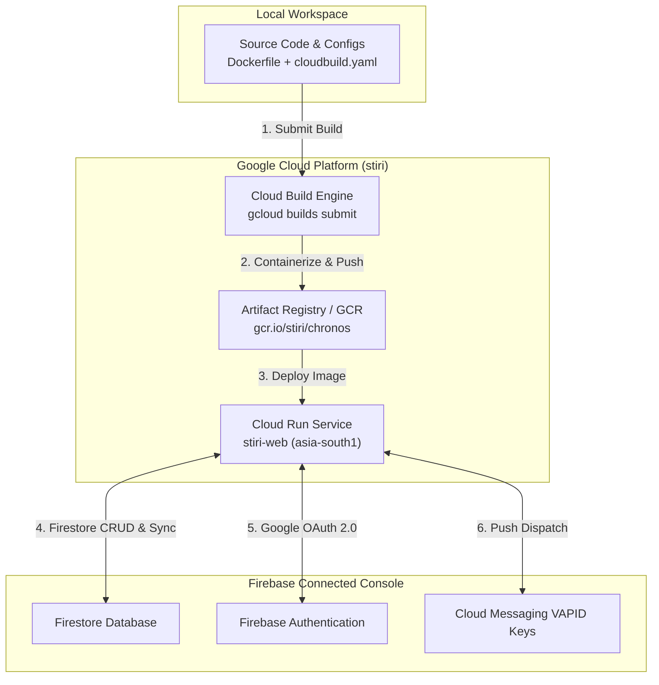

# Chronos — End-to-End Testing & Deployment Guide

Welcome to the **Chronos End-to-End Testing and Deployment Guide**. This document outlines step-by-step procedures for testing every feature, behavior, and edge case of Chronos both in the isolated sandbox **Demo Mode** and the live authenticated **Production Mode**.

At the end of this document, you'll find the comprehensive guide to deploying Chronos on **Google Cloud Run** using your existing GCP project **`stiri`** and connecting it with **Firebase Services**.

---

## Table of Contents
1. [Prerequisites & Environments](#1-prerequisites--environments)
2. [E2E Testing: Sandbox Demo Mode (No Setup Required)](#2-e2e-testing-sandbox-demo-mode-no-setup-required)
3. [E2E Testing: Live Production Mode (Real Credentials)](#3-e2e-testing-live-production-mode-real-credentials)
4. [Edge Cases & Error Handling Checklist](#4-edge-cases--error-handling-checklist)
5. [Deployment Guide: Google Cloud Run & Connected Firebase (`stiri` project)](#5-deployment-guide-google-cloud-run--connected-firebase-stiri-project)

---

## 1. Prerequisites & Environments

Chronos operates in two distinct runtime paradigms to accommodate both hackathon evaluation judges and actual users:

*   **Demo Mode (Hermetic Sandbox)**: Enabled via the `[DEMO MODE]` switcher in the top navigation bar. It intercept all network, database, and API interactions, replacing them with stateful simulated contexts in React state. No external credentials, billing, or accounts are required.
*   **Production Mode (Real Cloud)**: Connected directly to Vertex AI, Firebase Firestore, Google Calendar, Google Tasks, and Firebase Cloud Messaging (FCM). Requires actual OAuth sign-in.

---

## 2. E2E Testing: Sandbox Demo Mode (No Setup Required)

This walkthrough is optimized for quick, end-to-end user experience audits. No credentials are required.

### Step 2.1: Initial Onboarding & Quiz
1. Run the server locally: `npm run dev` and navigate to `http://localhost:3000`.
2. Hit the **"Get Started"** button to start the immersive **Onboarding Flow**.
3. Select a Persona Mode:
   *   **Student** (Focuses on assignments, exams, and classes)
   *   **Professional** (Focuses on sprints, meetings, and reviews)
   *   **Entrepreneur** (Focuses on pitch decks, launches, and recruiting)
4. Take the **Personality Quiz**: Toggle preferences and selection styles (e.g. choose *Marathoner* work style, *Drill Sergeant* accountability mode, *Casual* communication, and peak morning hours).
5. Complete onboarding. The application will automatically redirect you to the main dashboard.

### Step 2.2: Demo Mode Switch & Persona Loading
1. Locate the blinking neon **`[DEMO MODE]`** toggle button in the TopBar.
2. Toggle it **ON**.
3. Verify that the system instantly populates the dashboard with a full set of 15+ highly specific persona tasks matching your chosen mode (e.g., *Machine Learning Assignment* with an active crimson **Rescue Alert** badge if you chose the Student mode).
4. Navigate to the Sidebar, toggle the Persona selection, and switch modes (e.g., from *Student* to *Professional*). Watch the entire dashboard, tasks board, and analytics instantly adapt with matching mock logs.

### Step 2.3: Immersive Rescue Mode Action Center
1. On the Dashboard, find the task highlighted with a pulsing red banner (e.g., *"ML Assignment"* with the text *"🚨 URGENT: DUE IN 45 MINS"*).
2. Click the **"Rescue Mode"** action button.
3. Review the terminal-themed generation transition overlay screen showing AI-guardian activity.
4. Once loaded, verify the full-screen interactive **Rescue Action Center**:
   *   **Adaptive Countdown**: Check the running neon-tinted countdown clock. Watch it tick downwards.
   *   **Milestone Step Checklist**: Review the broken-down checklist of steps (e.g., *"Read prompt"*, *"Draft math formula"*, etc.).
   *   **Expert Strategy Tips**: Click to expand and read expert context-aware AI strategy guidelines.
   *   **Commitments & Sacrifices**: Check the trade-offs tracker (e.g. *"Skip dinner"*, *"Decline phone call"*).
5. **Clutch Completion Flow**:
   *   Click and check off each step inside the Milestone Checklist.
   *   When the final step is checked, observe the beautiful **Glassmorphism Reward Modal** transition in.
   *   Verify that your user level progression bar fills up, awarding **+50 Base XP** with a **1.5x Clutch Multiplier** (+75 XP total).
   *   Click *"Back to Dashboard"* to exit.

### Step 2.4: Premium Ghost Worker Studio
1. Navigate to the **Tasks Board** (Kanban card grid) via the sidebar.
2. Hover over any task card and click the translucent **"Ghost Worker (Ghost icon)"** action icon.
3. Observe the right-aligned **Ghost Worker Studio Drawer** slide out.
4. Toggle the **Segmented Deliverable Selector** between:
   *   **Email Draft** (for emails to professors/clients)
   *   **Markdown Document** (for guides or technical specifications)
   *   **Code Template** (for initial scripts or models)
5. Enter additional custom instructions and click **"Generate Draft"**.
6. Review the generated tabs:
   *   **Preview Tab**: Renders structured Markdown output beautifully (headers, lists, bold text, codeblocks).
   *   **Edit Raw Tab**: A custom text area allowing manual editing of the output string.
7. Click **"Export"**. Since we are in Demo Mode, a `.md` Markdown file downloads directly to your device.

### Step 2.5: Voice Chat Sidebar
1. Locate the AI Chat Sidebar on the right.
2. Click the **"Microphone"** icon in the chat input.
3. Verify the voice capture interface triggers:
   *   Microphone icon pulses with a breathing cyan neon outline.
   *   A glowing glassmorphism waveform HUD slides up showing animated visual equalizer bars.
4. Speak clearly: *"Create high priority task to review deployment scripts due tomorrow at noon."*
5. Verify that your voice is transcribed instantly in real-time in the text box.
6. Press Enter. The Core Agent processes your instruction, uses Gemini Function Calling to execute the creation, and returns a streaming chat message: *"I've created the task: Review deployment scripts. Priority: High, Deadline: Tomorrow 12:00 PM."*
7. Check your dashboard list to verify the task was added.

### Step 2.6: OCR Camera Scanner
1. Click the **"Camera"** icon in the chat sidebar input box.
2. Grant camera permissions. The live media video stream opens inside a glassmorphic container.
3. Click the **"Capture Snapshot"** camera button.
4. Verify that the image is frozen, a loading HUD starts, and the Gemini OCR document parser streams back structured suggestions.
5. In the confirmation screen:
   *   Review parsed task suggestions (e.g. *"Physics Assignment"* with inferred priority *High* and parsed deadline *June 30*).
   *   Check/uncheck items.
   *   Click **"Add Tasks"** to bulk-create all checked items instantly on your Kanban board.

### Step 2.7: Analytics & SVG Streak Heatmap
1. Click **"Analytics"** in the sidebar to open the Analytics portal.
2. Toggle range intervals: **"TODAY"**, **"THIS WEEK"**, **"THIS MONTH"**, and **"ALL"**.
3. Verify the **Productivity Bar & Line Charts**:
   *   Hover over bars to check active tooltips.
   *   Verify bar coloring changes dynamically based on the focus time (e.g., *Pink* for focus periods $<60\text{m}$, *Amber* for $<120\text{m}$, *Neon Green* for $\ge 120\text{m}$).
4. Verify the **365-Day SVG Streak Heatmap**:
   *   A full year-view activity grid renders.
   *   Hover your cursor over active grid cells; verify that a coordinates-pinned popover tracking card appears with the exact date, completed tasks count, and focus hours.
5. Click **"EXPORT TELEMETRY"** to download raw daily JSON files.
6. Click **"PRINT REPORT"**; verify that custom CSS stylesheets are applied to cleanly format page contents for PDF print exports, hiding sidebars and buttons.

---

## 3. E2E Testing: Live Production Mode (Real Credentials)

Once deployment is complete (see section 5), test the actual live cloud integration end-to-end.

### Step 3.1: Google OAuth Registration & Database Sync
1. Navigate to your production URL.
2. Click **"Sign In with Google"**.
3. Log in with a real Google Account.
4. Upon redirected onboarding completion, open the Firestore Console under the connected project **`stiri`**.
5. Verify that a new document matching your Google User ID has been created inside the `/users` collection containing your personality profiles.

### Step 3.2: Real-time Firestore Task CRUD
1. On the main task list, add a task: *"Draft Presentation"* (Priority: *High*, Estimated Time: *45 mins*, Category: *Work*).
2. Look at Firestore: check that a document has appeared in `/users/{userId}/tasks/{taskId}` with matching fields.
3. Click the checkbox on the task card to complete it.
4. Verify that:
   *   The task state merges to `completed`.
   *   `completedAt` is stored as a real timestamp.
   *   XP is awarded and level-up calculations increment dynamically inside `/users/{userId}/gamification/stats`.

### Step 3.3: Live Google Calendar Synchronizer
1. Create a task and toggle the **"Add to Google Calendar"** switch.
2. Open your Google Calendar inside another tab.
3. Check that a calendar event matching your task's title, description, and deadline has been inserted correctly.
4. Modify the deadline in Chronos, or toggle the task as completed. Check that Google Calendar updates or marks the event accordingly.

### Step 3.4: Real-time FCM Notification Engine
1. Subscribe to push notifications when prompted by your browser.
2. Open your database console, navigate to `/users/{userId}`, and verify a valid **`fcmToken`** field is registered.
3. Trigger a deadline checking audit request using the cron URL or a cURL script (simulating a task due within the next hour).
4. Verify that:
   *   A visual system notification banner slides out on your desktop with the text *"🚨 URGENT: [Task Name] is due in less than 1 hour!"*
   *   The notifications bell dropdown in your Chronos top navigation bar increments its unread count.
   *   The alert displays in the notifications panel. Click **"Mark as Read"** and verify that it updates instantly in the database with `read: true`.

---

## 4. Edge Cases & Error Handling Checklist

Verify that Chronos handles extreme input configurations gracefully:

| Feature Area | Trigger / Scenario | Expected Safe Behavior | Verified |
|---|---|---|:---:|
| **Task Estimations** | Enter estimated minutes as `0` or negative. | System limits bounds to a minimum of 1 minute; displays validation errors. | [ ] |
| **Deadlines** | Set task deadline to a historic date. | System marks task as immediately `overdue` and logs it in the corresponding calendar. | [ ] |
| **Media Captures** | Revoke browser camera or microphone permissions, then click Voice or Scanner buttons. | Display a graceful warning banner: *"Camera access blocked. Please enable permissions in your site settings."* | [ ] |
| **OCR Scanner Failures** | Upload/capture a blank white paper or highly blurry photo. | Gemini model returns an empty array; the scanner displays: *"No clear tasks detected. Try adjusting lighting or capture a distinct document."* | [ ] |
| **Large Data Heatmaps** | Simulate $300+$ active daily logs in Firestore. | SVG Heatmap renders successfully; pagination is responsive without blocking browser UI cycles. | [ ] |
| **OAuth Token Expiration** | Force-expire or revoke the Google OAuth session token. | NextAuth intercepts the expired session, triggers a silent refresh, or safely log out redirecting to `/login` with an informative banner. | [ ] |

---

## 5. Deployment Guide: Google Cloud Run & Connected Firebase (`stiri` project)

Follow this step-by-step guide to compile and host Chronos on **Google Cloud Run** using your active GCP project **`stiri`**, fully integrated with **Firebase Services**.



### Step 5.1: GCP Project Activation & Billing Check
1. Open the [Google Cloud Console](https://console.cloud.google.com).
2. Select your existing project: **`stiri`**.
3. Navigate to **Billing** and verify that Billing is enabled for the `stiri` project. (Billing is mandatory to deploy on Cloud Run and invoke Vertex AI API models).

### Step 5.2: Enable Required APIs on `stiri`
Run the following commands in your terminal (or enable them manually inside GCP APIs & Services Marketplace):

```bash
gcloud services enable aiplatform.googleapis.com \
    run.googleapis.com \
    cloudbuild.googleapis.com \
    containerregistry.googleapis.com \
    calendar.googleapis.com \
    gmail.googleapis.com \
    tasks.googleapis.com \
    --project=stiri
```

### Step 5.3: Set Up Firebase Services
1. Go to the [Firebase Console](https://console.firebase.google.com).
2. Click **"Add Project"** (or **"Create a Project"**).
3. In the project selection box, select your existing Google Cloud project: **`stiri`** (Do NOT create a brand-new project; linking your existing `stiri` project is seamless).
4. **Cloud Firestore**:
   *   Click **Firestore Database** in the sidebar.
   *   Click **Create Database**.
   *   Select location: **`asia-south1`** (Mumbai) or your preferred nearest target region.
   *   Set security rules: Start in *Test Mode* (or upload the local [firestore.rules](file:///c:/Users/risha/OneDrive/Desktop/vibe2ship/firestore.rules) file).
5. **Firebase Authentication**:
   *   Click **Authentication > Sign-in Method**.
   *   Enable the **Google** provider.
6. **Firebase Cloud Messaging (FCM)**:
   *   Go to **Project Settings (Gear icon) > Cloud Messaging**.
   *   Under **Web Configuration**, click **Generate Key Pair** in the Web Push Certificates tab to generate your **VAPID Key**.
   *   Copy this string; it is your `NEXT_PUBLIC_FIREBASE_VAPID_KEY`.

### Step 5.4: Generate Firebase Admin Service Account Key
1. In the Firebase Console, go to **Project Settings > Service Accounts**.
2. Click **Generate New Private Key** to download the Service Account private key JSON file.
3. Open a terminal and base64-encode the file contents.
   *   **On Windows (PowerShell)**:
       ```powershell
       [Convert]::ToBase64String([System.IO.File]::ReadAllBytes("path/to/service-account.json"))
       ```
   *   **On macOS / Linux (Bash)**:
       ```bash
       base64 -w 0 path/to/service-account.json
       ```
4. Copy the entire output string. This is your `FIREBASE_SERVICE_ACCOUNT_KEY` environment variable.

### Step 5.5: Configure Google OAuth 2.0 Credentials
1. In GCP Cloud Console, navigate to **APIs & Services > Credentials**.
2. Click **Create Credentials > OAuth Client ID**.
3. Select Application Type: **Web Application**.
4. Set name: `Chronos Deployment Client`.
5. **Authorized JavaScript Origins**:
   *   `http://localhost:3000` (for local audits)
   *   `https://chronos-stiri-xxxx.a.run.app` (your production Cloud Run URL—you can add this *after* the initial deploy as well).
6. **Authorized Redirect URIs**:
   *   `http://localhost:3000/api/auth/callback/google`
   *   `https://chronos-stiri-xxxx.a.run.app/api/auth/callback/google` (replace with your Cloud Run deployment URL).
7. Save and copy both the **Client ID** and **Client Secret**.

### Step 5.6: Compile & Deploy via Cloud Build
Submit your container build directly to GCP Cloud Build under the `stiri` project. This reads the local `Dockerfile` and `cloudbuild.yaml` configurations to compile your Next.js project into a lightweight standalone container and host it on Google Cloud Run.

```bash
gcloud builds submit --config cloudbuild.yaml --project=stiri
```

### Step 5.7: Set Production Environment Variables
Once the deployment finishes, GCP will output your live service URL. We must now apply our secure production configuration.

1. Go to **Google Cloud Console > Cloud Run** and select the **`chronos`** service.
2. Click **"Edit & Deploy New Revision"**.
3. Under the **"Variables"** configuration tab, populate the following keys exactly:

| Variable Name | Value / Description |
|---|---|
| `NODE_ENV` | `production` |
| `VERTEX_PROJECT_ID` | `stiri` |
| `VERTEX_LOCATION` | `global` |
| `GEMINI_MODEL_FLASH` | `gemini-3.5-flash` |
| `GEMINI_MODEL_PRO` | `gemini-3.1-pro` |
| `NEXT_PUBLIC_FIREBASE_API_KEY` | *Your Firebase Web API Key* |
| `NEXT_PUBLIC_FIREBASE_AUTH_DOMAIN` | `stiri.firebaseapp.com` |
| `NEXT_PUBLIC_FIREBASE_PROJECT_ID` | `stiri` |
| `NEXT_PUBLIC_FIREBASE_STORAGE_BUCKET` | `stiri.appspot.com` |
| `NEXT_PUBLIC_FIREBASE_MESSAGING_SENDER_ID` | *Your Firebase Messaging Sender ID* |
| `NEXT_PUBLIC_FIREBASE_APP_ID` | *Your Firebase App ID* |
| `FIREBASE_SERVICE_ACCOUNT_KEY` | *Your base64-encoded Service Account JSON string* |
| `GOOGLE_CLIENT_ID` | *Your Google OAuth Client ID* |
| `GOOGLE_CLIENT_SECRET` | *Your Google OAuth Client Secret* |
| `NEXTAUTH_SECRET` | *Generate a random secure key (e.g. `openssl rand -base64 32`)* |
| `NEXTAUTH_URL` | *Your Cloud Run service live URL (e.g. `https://chronos-xxxx.a.run.app`)* |
| `NEXT_PUBLIC_FIREBASE_VAPID_KEY` | *Your FCM VAPID public key string* |

4. Click **Deploy**.
5. Return to **APIs & Services > Credentials** on GCP Console and add your live URL (`https://chronos-stiri-xxxx.a.run.app`) to your Authorized Origins and Authorized Redirect URIs as configured in Step 5.5.

**Chronos is now live and fully operational in production! 🎉**
